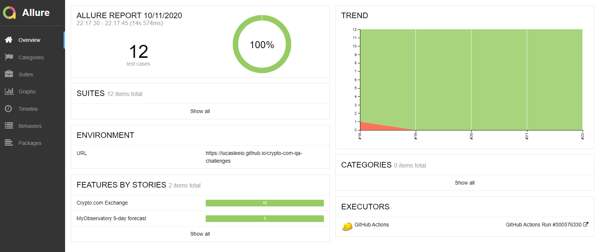

# Crypto.com QA Challenges

## Tech Stacks

- Python
- Behave
- Selenium

## Setup

### Running with Github Actions

A workflow was set using [Github Actions](https://github.com/lucasleeio/crypto-com-qa-challenges/actions) to run the tests on push/dispatch. Allure reports of the runs can be seen [here](https://lucasleeio.github.io/crypto-com-qa-challenges/).

### Running Locally

0.  Clone this repository.

1.  (Optional) Setup a new virtual environment.

        python -m venv venv

2.  Install the required dependencies.

        pip install -r requirements.txt

3.  Ensure the correct version of [ChromeDriver](https://chromedriver.chromium.org/) is present in PATH.

## Task 1

### Task description

The URL of the Exchange page of crypto.com was given. (https://crypto.com/exchange)

Write an automated test for the trade page about CRO/USDC, including any reasonable test cases. Do not access the trade page directly via its URL.

### Running the test

Run the test with behave.

    behave ./task1/features

- Note that the default setting is to run the test in headless mode. If demonstration of interaction with a visible browser is needed, please change the config `is_headless = true` to `false` in `behave.ini`.

### Design details

- The simple test case of accessing CRO/USDC Trade page through Exchange page is an obvious choice for the first test case. Nothing really stands out in this test case as it is simply to click and navigate. Note the `--disable-smooth-scrolling` option added to the driver, otherwise the step of clicking on the CRO/USDC row may be flaky as it is located at the bottom of the page and may take some time to scroll to with smooth scrolling, raising element not clickable error.

- The second and third test case were chosen to demonstrating the data driven capability of Behave, utilizing Scenario Outline. The second test case test for the ability to put price and amount values directly into the trade form directly when a row in the depth table was clicked. This test case is a bit flaky in nature as the price updates constantly, but the order of step execution was carefully constructed to minimize time delay.

- The third test case test for the total amount calculation in the Buy/Sell trade form, which also demonstrate to ability to interact with input fields, both to read and set values.

## Task 2

### Task description

The app of [MyObservatory](https://www.hko.gov.hk/en/myobservatory.htm) from Hong Kong Observatory was given.

Write an automated test for the API used in the 9-day forecast page of the app, testing its response status and extracting the relative humidity for the day after tomorrow from its response.

### Running the test

Run the test with behave.

    behave ./task2/features

### Design details

This is a rather straight-forward task. The API endpoint was captured with [Charles](https://www.charlesproxy.com/), and then further inspected with [Postman](https://www.postman.com/) to understand the json structure of its response, which helps in extracting the needed data. [Requests](https://requests.readthedocs.io/en/master/) was used as usual to handle sending request, and [datetime](https://docs.python.org/3/library/datetime.html) for calculating the day after tomorrow.

