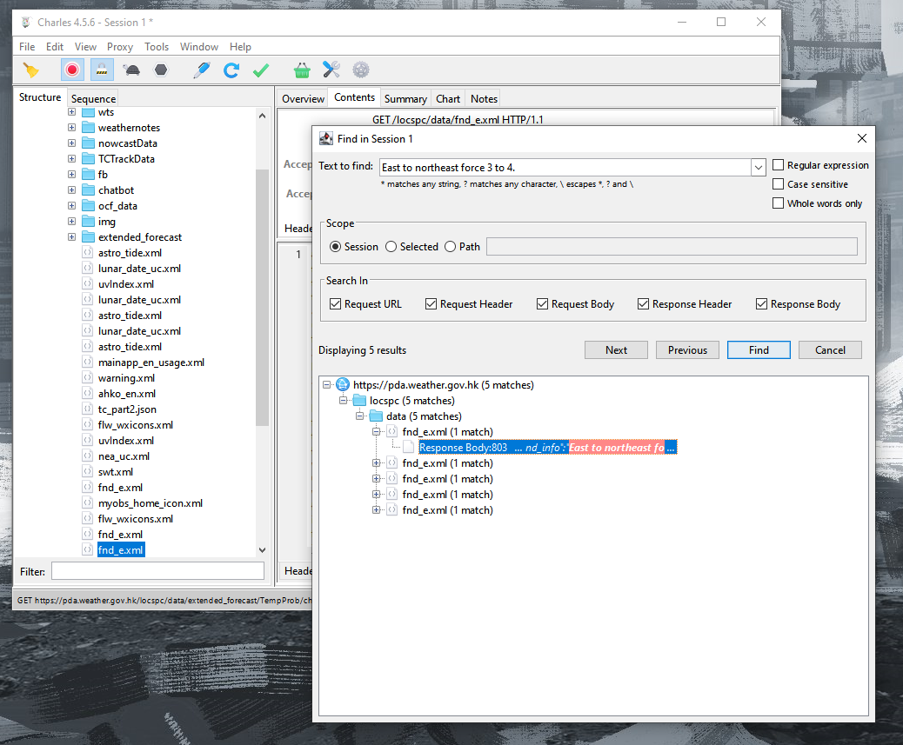
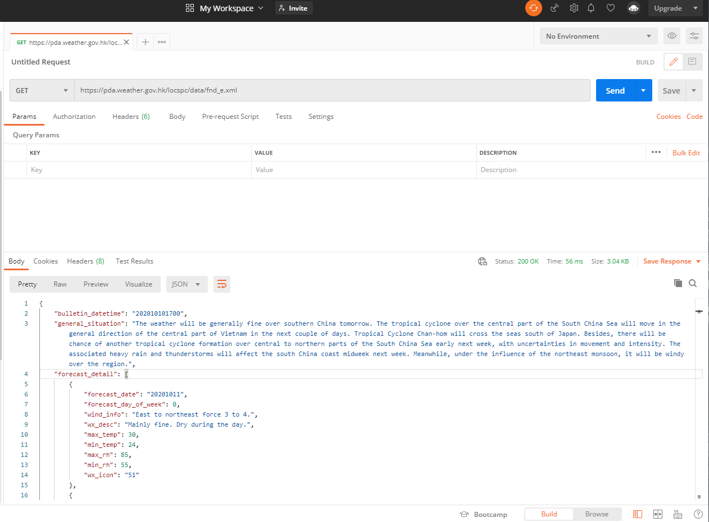

# Crypto.com QA Challenges

## Tech Stacks

- Python
- Behave
- Selenium

## Setup

0.  (Optional) Setup a new virtual environment.

        python -m venv venv

1.  Install the required dependencies.

        pip install -r requirements.txt

2.  Ensure the correct version of [ChromeDriver](https://chromedriver.chromium.org/) is present in PATH.

## Task 1

### Task description

The URL of the Exchange page of crypto.com was given. (https://crypto.com/exchange)

Write an automated test for the trade page about CRO/USDC, including any reasonable test cases. Do not access the trade page directly via its URL.

### Running the test

1.  Change current working directory into `task1`

        cd task1

2.  Run the test with behave

        behave

### Design details

[WIP]

## Task 2

### Task description

The app of [MyObservatory](https://www.hko.gov.hk/en/myobservatory.htm) from Hong Kong Observatory was given.

Write an automated test for the API used in the 9-day forecast page of the app, testing its response status and extracting the relative humidity for the day after tomorrow from its response.

### Running the test

1.  Change current working directory into `task2`

        cd task2

2.  Run the test with behave

        behave

### Design details

This is a rather straight-forward task. The API endpoint was captured with [Charles](https://www.charlesproxy.com/), and then further inspected with [Postman](https://www.postman.com/) to understand the json structure of its response, which helps in extracting the needed data. [Requests](https://requests.readthedocs.io/en/master/) was used as usual to handle sending request, and [datetime](https://docs.python.org/3/library/datetime.html) for calculating the day after tomorrow.

